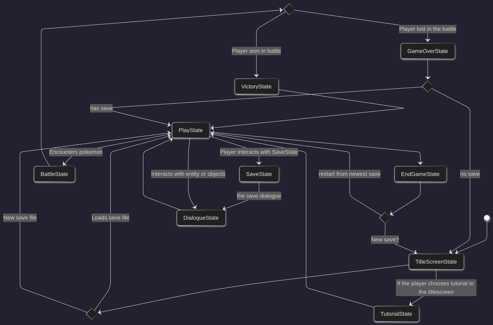
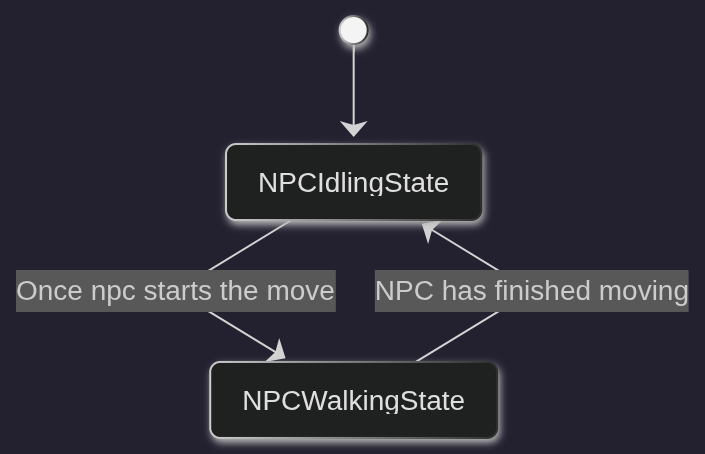
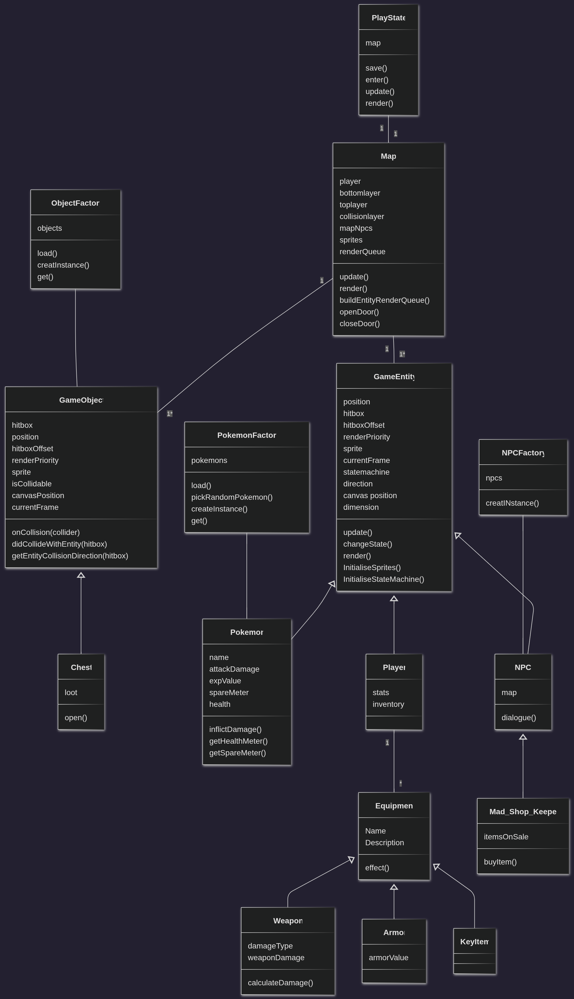

# Final Project

-   [x] Read the [project requirements](https://vikramsinghmtl.github.io/420-5P6-Game-Programming/project/requirements).
-   [x] Replace the sample proposal below with the one for your game idea.
-   [ ] Get the proposal greenlit by Vik.
-   [ ] Place any assets in `assets/` and remember to update `src/config.json`.
-   [ ] Decide on a height and width inside `src/globals.js`. The height and width will most likely be determined based on the size of the assets you find.
-   [ ] Start building the individual components of your game, constantly referring to the proposal you wrote to keep yourself on track.
-   [ ] Good luck, you got this!

---

# 🗡️ Dungeons & Pokémons: Remastered

## 📖 Description

In this game you will assume the role of a dungeon crawler whose whole purpose is to explore, loot, and get stronger by diving into these deep and forgotten structures. You will have the option to choose between various classes and abilities to aid you on your journey, but beware because in this strange world, portals opened and a new species of monsters have invaded and hid in all of these mysterious houses called Pokémon and they will defend themselves if they feel threatened.

Shall you slay your way to the treasures, or act, persuade, and befriend to get what you want? Create new enemies or find new partners to help you in these exciting adventures?

**Create a legend worth telling.**

---

## 🎮 Gameplay

Every dungeon always has a story to tell and so the goal of this game is to uncover the secrets and the story told by this dungeon.

### 🗺️ Exploring

You will play this game from a top-down perspective and you will have to travel between various hallways and interact with the environment around you to find loot and treasure. Objects such as levers, chests, signs, and peculiar surroundings are all examples of what you could expect to interact with using the ENTER key. Such objects are called "SAVE Crystals" with which the user can interact and save their game.

When you start the game, you will get the option to choose between a number of classes that each have different weapons, abilities, and perks that may help you while traversing these catacombs. This enables the player to choose various experiences within the fighting and possibly even interaction with the environment.

### ⚔️ Battle

You will encounter Pokémon throughout the dungeon that will act in self-defense and here you will have a unique RPG turn-based style fighting reminiscent of Undertale and Deltarune developed by Toby Fox.

#### 🎯 Player

The player will have 4 action buttons to select when in a fight: Fight, Act, Items, and Spare. They can select them using the ENTER key and the SHIFT key to deselect. They also are able to receive rewards after each battle.

-   **Fight**: The player will have the choice of a few attacks based on the character chosen and depending on the style of move, the player will have to perform an interaction to decide the strength of the attack. The player's level, which will be discussed in more detail lower, will affect the base strength of the attacks.

-   **Act**: The player will have a set base of acts they can perform to battle without using attacks. These acts can be interactive or instant acts that will help you in calming the foe down. In certain battles, you may get special acts for a more immersive and less repetitive experience.

-   **Items**: Here the player will have access to certain items that can help them within the fight such as healing, damage, or boosting items.

-   **Spare**: Once a player has calmed down the enemy enough, they are able to spare the enemy. This will not reward the player with more EXP, but may still receive rewards.

#### 👾 Enemy

When it is the enemy's turn, your spectre will be put within a box and your goal is to dodge the enemy's attacks. When you get hit, you will lose some health depending on the attack of the enemy. Your spectre will be controllable using the WASD keys and while in this state you can only dodge.

If your health goes down to 0, you lose and have to restart from the nearest "SAVE Crystal" you have interacted with and your progress between now and the last time you saved will be lost, so save frequently!

### 💬 NPCs

While wandering around the dungeon you may come across some NPCs that may help you in your journey or be a small nuisance. You are able to interact with them in various ways like get dialogue, a shop, or even some actions you can perform with that NPC.

---

## ✅ Requirements

1. The user shall choose a class upon starting the game
    - Must have one class
    - **Nice to have more than one class**
2. The user shall interact with objects and entities within the game
    - Must have chests implemented and one NPC
    - **Nice to have some interactive puzzles**
3. The user shall receive dialogue from certain events within the game
    - **NICE TO HAVE**: Animated dialogue boxes
4. The user shall save the game using "SAVE Crystals"
5. The user shall randomly get into fights with Pokémon
    - Must have one boss fight with unique attacks and other Pokémon have same attack style
    - **Nice to have multiple boss fights with unique attacks**
6. The user shall choose to either fight, act, use an item, or spare
    - Must have one fight style
    - **Nice to have multiple fight styles (if many classes implemented)**
7. The user shall control a spectre version of their character when attacked
8. The user shall receive rewards upon winning a battle such as money, EXP, and other items
9. The user shall restart at the newest save point they interacted with
10. The user shall find treasure and accessories to help them and customize their character
    - Must have obtainable accessories and objects affecting the dungeon
    - Nice to have other helpful items in battle
11. The user shall change their armor and accessories
12. The user shall increase level upon reaching a certain amount of EXP
13. **NICE TO HAVE**: The user shall have their abilities power increased after level up
14. The user shall reach the **end** of the story by exploring

---

## 📊 State Diagram

### Game States:

### Player States:

### Entity States:

---

## 🏗️ Class Diagram

---

## 🎨 Wireframes

Here is the concept layout and look of my game. Things are subject to change and **WILL** change.

---

## 📦 Assets

We used app.diagrams.net to create the wireframes. Wireframes are the equivalent to the skeleton of a web app since they are used to describe the functionality of the product and the user's experience.

The GUI of the player exploring will be minimal to immerse the player into the dungeon with only the buttons the player can press for any menus. It will have a darker theme but yet still a little playful with Pokémon.

Upon starting, the first room of the dungeon will be a tutorial level with the controls.

### 🖼️ Images

Most sprites will be taken from https://lucidious89-tutorials.gitbook.io/deluxe-battle-kit-tutorial/deluxe-battle-kit-for-v21.1/add-on-tutorials/animated-pokemon-system for the Pokémon sprites.

### 🔤 Fonts

Since this is a game inspired by Deltarune/Undertale, I will be using the Deltarune font for most of my text. It is clean, fits the style, and it's easy to read.

[Deltarune font](https://fontstruct.com/fontstructions/show/2008226/undertale-deltarune-text-font-extended) found on fontstruct.

### 🎵 Sounds and Music

A lot of the sounds will be used from [Deltarune sound effects](https://www.101soundboards.com/boards/34569-deltarune-sound-effects) found on 101SoundBoards.com as well as music. Everything was originally made by Toby Fox.
